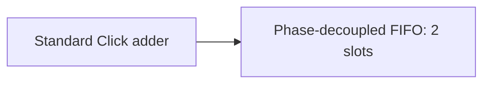

# Build a native Click adder

This example adds two 8-bit operands, keeps the 9-bit result, and carries a 4-bit
tag through the pipeline. It combines a standard Click transform with a two-slot
phase-decoupled FIFO. All three slots start empty and propagate backpressure.



Use the [standalone quickstart](../examples/quickstart) with the toolchain in
[getting started](getting-started.md). This is a consumer of the library JAR;
there is no dependency on repository-internal Scala classes. Emission needs
firtool, and the test needs Icarus 13 on PATH. Python and Verilator are not needed
for these two commands, run from the quickstart directory:

```text
sbt "runMain EmitClickAdder"
sbt "testOnly ClickAdderSpec"
```

## Implement the pipeline

The complete [ClickAdder.scala](../examples/quickstart/src/main/scala/ClickAdder.scala)
is ready to use as `src/main/scala/ClickAdder.scala` in your own project:

<!-- source: ../examples/quickstart/src/main/scala/ClickAdder.scala -->
```scala
import chisel3._
import chiselasync.bundled.{ClickStage, PhaseDecoupledClickFifo}
import chiselasync.core.AsyncModule
import chiselasync.metadata.{ClickTiming, ExportDesign}
import chiselasync.protocol.TwoPhase
import java.nio.file.Paths

class ClickOperands extends Bundle {
  val a = UInt(8.W)
  val b = UInt(8.W)
  val tag = UInt(4.W)
}

class ClickSum extends Bundle {
  val sum = UInt(9.W)
  val tag = UInt(4.W)
}

/** A native Click adder followed by two phase-decoupled storage slots.
  * All three slots reset empty. Results preserve the input tag and the carry.
  */
class ClickAdder(timing: ClickTiming = ClickTiming.Simulation) extends AsyncModule {
  val in = twoPhaseInput("in", new ClickOperands)
  val out = twoPhaseOutput("out", new ClickSum)

  private val add = asyncChild("add") { domain =>
    new ClickStage(
      inGen = new ClickOperands,
      outGen = new ClickSum,
      transform = (operands: ClickOperands) => {
        val result = Wire(new ClickSum)
        result.sum := operands.a +& operands.b
        result.tag := operands.tag
        result
      },
      timing = timing,
      domain = domain)
  }
  private val queue = asyncChild("queue") { domain =>
    new PhaseDecoupledClickFifo(
      gen = new ClickSum, depth = 2, timing = timing, domain = domain)
  }

  TwoPhase.connect(add.in, in)
  TwoPhase.connect(queue.in, add.out)
  TwoPhase.connect(out, queue.out)
  contract.capacity(3)
}

object EmitClickAdder extends App {
  ExportDesign.emit(new ClickAdder, Paths.get("generated-click"))
}
```

`twoPhaseInput` and `twoPhaseOutput` create ordinary Chisel IO and register their
channel contracts. `asyncChild` connects each child's reset and registers it in
the parent's reset domain. `TwoPhase.connect(consumer, producer)` checks payload
types, widths and reset identity. The declared capacity is the add stage's one
slot plus the FIFO's two slots; declaring capacity does not create storage.

The transform returns a `ClickSum` Bundle. `+&` preserves the carry, so `255 + 255`
produces `510`; the tag is copied unchanged. Because the phase-decoupled FIFO
starts empty, it needs no `start` signal. A feedback network with an initial token
uses the [separate initialization contract](click.md#initialize-a-feedback-ring).

## Check results and backpressure

The complete test uses typed Bundle literals for both input and expected output.
Ordinary integer addition supplies the expected results independently of the
hardware transform. Repeated identical jobs are still separate transfers.

<!-- source: ../examples/quickstart/src/test/scala/ClickAdderSpec.scala -->
```scala
import chisel3._
import chisel3.experimental.BundleLiterals._
import chiselasync.testing.AsyncTest
import chiselasync.testing.AsyncTest.{Input, Output}
import java.nio.file.Paths
import org.scalatest.funsuite.AnyFunSuite

class ClickAdderSpec extends AnyFunSuite {
  test("tagged Click adder preserves carry, order and repeated tokens under backpressure") {
    val jobs = Seq((0, 0, 0), (255, 255, 15), (85, 85, 7), (85, 85, 7)) ++
      (0 until 40).map(i => (i * 37 % 256, i * 71 % 256, i % 16))
    val inputs = jobs.map { case (a, b, tag) =>
      (new ClickOperands).Lit(_.a -> a.U(8.W), _.b -> b.U(8.W), _.tag -> tag.U(4.W))
    }
    val expected = jobs.map { case (a, b, tag) =>
      // Independent integer arithmetic; do not reuse the hardware transform.
      (new ClickSum).Lit(_.sum -> (BigInt(a) + b).U(9.W), _.tag -> tag.U(4.W))
    }
    val results = AsyncTest.check(
      new ClickAdder,
      Seq(Input.literals("in", inputs)),
      Seq(Output.literals("out", expected)),
      seeds = 1L to 64L,
      directory = Paths.get("build/click-adder"))
    assert(results.size == 64 && results.forall(_.variedCells > 0))
  }
}
```

`AsyncTest` varies the source and consumer pauses as well as each cell's delay.
Seeds 1 and 2 select the minimum and maximum delay corners; the other seeds select
independent values within the declared bounds. The helper checks exact output
order, stable pending data, protocol completion and local Click timing. The
64 configurations each deliver 44 tagged results. Logs and delay selections are
retained under `build/click-adder`; use another directory to preserve a later run
separately.

## Inspect the export

`EmitClickAdder` writes the RTL, primitive models and timing contracts into
`generated-click`. The test creates its own export under `build/click-adder/export`.
With the repository's contributor environment, validate either directory:

```text
python /path/to/chisel-async/tools/check_export.py /path/to/quickstart/generated-click
```

The [consumer verification command](contributing.md) compiles this example
against the packaged JAR, runs the test, records all 64 seed results and validates
both exports. Documentation checks also compare the code blocks above with the
executable source files.

`ClickTiming.Simulation` supplies digital experiment bounds. To map this design
to hardware, provide characterized cells and complete the [Click timing
obligations](click.md#primitives-and-timing), including local pulse widths,
setup/hold and routed skew. The example's delays are not physical performance data.
