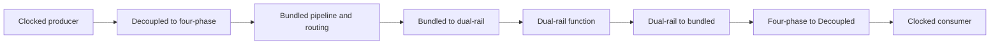

# Channels, tokens, and composition

A token is one transaction with a typed payload. Two consecutive transactions
containing the same bits are still two tokens. Components preserve order and
propagate backpressure; protocol edges, not changes in data, identify transfers.

## Logical intent and electrical encoding

`Channel[T]` is a Scala descriptor for a payload type and reset domain. It allocates
no storage and performs no conversion. Its factories create distinct interfaces:

| Factory | Interface | How a token is represented |
| --- | --- | --- |
| `.bundled` | `FourPhase[T]` | A request/acknowledge round trip alongside a data bus |
| `.twoPhase` | `TwoPhase[T]` | A request transition, followed by an acknowledgement transition |
| `.dualRail` | `DualRail[T]` | One of two rails asserted for each bit, then return to spacer |
| `.decoupled` | Chisel `DecoupledIO[T]` | `valid && ready` at the clock's rising edge |

The common intent is an ordered stream. Transfer events, holding rules, capacity,
and reset behavior still belong to each component. Creating two bindings does not
connect them. Converters contain state and have timing requirements.

## Types and directions

Payloads support explicitly sized `UInt`, `SInt`, `Bool`, and nested `Bundle`/`Vec`
structures made from those leaves. Unknown widths, unsupported leaf types, and
directioned payload fields are rejected. Use `IO(Flipped(channel.bundled))` for an
input and `IO(channel.bundled)` for an output; keep direction outside the payload.

The checked helpers take **consumer first, producer second**:

```scala
FourPhase.connect(next.in, previous.out)
TwoPhase.connect(next.in, previous.out)
DualRail.connect(next.in, previous.out)
```

These are schematic alternatives for matching encodings. They require identical
payload shapes and reset-domain objects. They never resize data or insert a
converter. Ordinary Chisel `:<>=` remains useful at standard clocked interfaces;
it does not perform the library's asynchronous reset-domain check.

## Acceptance, delivery, and reservation

Acceptance means a component takes responsibility for a token. Delivery means its
consumer commits that token. Reservation describes storage that cannot yet be
reused. These events need not coincide.

In a long-hold stage, rising input `ack` accepts; rising output `ack` delivers.
After delivery, the slot remains reserved until the output handshake fully
returns to idle. This prevents an early replacement from changing data still
owned by the old handshake.

A fork can deliver to one branch before all branches allow input acknowledgement.
A dual-rail half-buffer can deliver before upstream acknowledgement propagates.
Tests must follow the component's local contract rather than imposing the
long-hold stage's event order everywhere.

For a buffer, an independent ledger tracks
`accepted = delivered + outstanding + aborted`. Reset removes outstanding work;
it never retrospectively undelivers a token. A waiting offer is not automatically
an accepted token. [Protocol contracts](contracts.md) define the exact events.

## Reset is part of the interface

Every `AsyncModule` is a `RawModule` with an explicit active-high `AsyncReset`.
There is no hidden clock. All connected asynchronous components currently require
a coordinated reset and restart; arbitrary independent endpoint resets are unsupported.

Inside an `AsyncModule`, use:

```scala
val child = asyncChild("buffer")(d => new LongHoldBuffer(UInt(8.W), timing, d))
```

This schematic uses an existing `BundledTiming` value named `timing`. `asyncChild`
passes the parent's domain, wires reset, and registers the child contract. A
fresh root has a fresh `ResetDomain`; matching domain names do not establish
electrical equivalence. Reset identity is checked during elaboration, and export
also checks actual reset wiring.

Assert reset before withdrawing an in-flight offer or changing its held data.
Bring external request/acknowledgement drivers to idle while reset is asserted.
Hold reset until delayed cells quiesce. For clocked bridges, run the clocks
through synchronized local reset release before starting traffic. Do not treat
reset as an implicit rollback of memory or I/O effects.

## How the library fits into a design



Every boundary is explicit. Use only the conversions needed by your application;
each can add storage, latency, and reset/timing obligations. The
[four-style reference](examples.md#four-style-reference) provides a concrete
comparison of the same arithmetic function.

The library separates typed composition, primitive digital models, and compiler
metadata. Tests establish behavior within declared bounds. Mapping those models
to physical cells and closing wire, fork, setup/hold, and metastability constraints
is a separate implementation activity.
