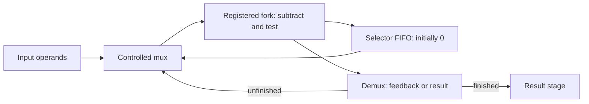

# Executable examples

The [standalone quickstart](../examples/quickstart) shows how to use chisel-async in
your own sbt project. It includes four-phase and native Click adder pipelines,
a controlled GCD loop, ScalaTest tests and a clocked bridge test. Follow
[getting started](getting-started.md) to run it, then explore the examples below.

Repository emitters live under
[`examples/src/main/scala/chiselasync/examples`](../examples/src/main/scala/chiselasync/examples).
In the configured contributor environment, emit a family with:

```text
python tools/sbt.py "examples/runMain chiselasync.examples.EmitComposition target/generated"
python tools/check_export.py
python verification/run_composition.py --help
```

The final command lists supported replay options; it does not run the campaign.
Use the corresponding runner without `--help` to execute it. Some campaigns require
additional fixtures or a new output directory. `tools/qualify.py` handles
emission order and fresh output paths automatically.

| Emitter | What to study | Campaign |
| --- | --- | --- |
| `EmitFixtures` | Behavioral buffers, typed payloads, primitive and timing fixtures; includes withdrawn-controller regression | `verification/run.py`, `verification/run_timing.py` |
| `EmitLongHold` | Published controller, type-changing transform, independently bounded delays | `verification/run_longhold.py` |
| `EmitArchitecture` | Dual-rail completion and explicit-clock bridge round trip | `verification/run_architecture.py` |
| `EmitOptimized` | Replicated pipelines under release/dedup versus debug export | `verification/run_optimized.py` |
| `EmitComposition` | FIFO, initial tokens, fork/join, mux, registered fork, demux, exclusive merge, feedback | `verification/run_composition.py`; new mux/fork behavior in quickstart `RoutingSpec` |
| `EmitPhase` | Arbitration, sequential two-phase composition, mixed encodings | `verification/run_phase.py`, `verification/run_closure.py`, `verification/run_mutex.py` |
| `EmitReference` | Common small function across four implementation styles | `verification/run_reference.py`, `verification/run_dims.py` |
| `EmitQdi` | Strong storage, truth tables, typed routing, mixed unequal paths | `verification/run_qdi.py`, `verification/run_qdi_sequences.py` |
| `EmitBoundaries` | Standard-Chisel RAM/ROM and pending events | `verification/run_boundaries.py` (also needs `EmitArchitecture`) |
| `EmitClick` | Native standard/phase-decoupled buffers, FIFOs and a one-token feedback ring | `verification/test_click.py`; standalone `ClickTestSpec` |

`EmitControllerComparison` reproduces a controller comparison, including a known
race in a withdrawn design. Use it to study that failure; use the documented
long-hold or Click components for new bundled-data designs.

## Native Click adder

The [Click adder walkthrough](click-example.md) includes complete source and a
ScalaTest test. A standard Click stage accepts two operands and a tag, then sends
the widened sum and preserved tag through a phase-decoupled FIFO. It shows typed
port helpers, named constructor arguments, shared reset and contract export.

From the standalone quickstart, run `sbt "runMain EmitClickAdder"` and
`sbt "testOnly ClickAdderSpec"`. The test checks 44 jobs under 64 independent
delay configurations, including carry, repeated tokens and consumer backpressure.

For an initialized feedback network, see
[ClickRing.scala](../examples/src/main/scala/chiselasync/examples/ClickRing.scala)
and the [start-signal requirements](click.md#initialize-a-feedback-ring).

## Four-style reference

[`EmitReference.scala`](../examples/src/main/scala/chiselasync/examples/EmitReference.scala)
implements a small adder in behavioral, bundled-data, DIMS dual-rail and clocked
GALS forms. A common independent arithmetic oracle checks the result. Converters,
stalls, reset and encoding-specific monitors test integration as well as arithmetic.

Use it to understand differences in handshakes, storage, indication and clock
boundaries. Raw simulation latency reflects selected model delays and clocks.
It is not a silicon area, power, energy or throughput comparison. Those conclusions
need comparable physical implementations and measurements.

## GCD with controlled feedback

[Gcd.scala](../examples/quickstart/src/main/scala/Gcd.scala) implements Euclid's
subtraction algorithm using only public components. Run `sbt "runMain EmitGcd"`
or test it with `sbt "testOnly AsyncDesignSpec"` in the standalone quickstart.



The initial selector chooses the external input. Each unfinished iteration emits
selector 1 and feeds the updated operands back; completion emits selector 0 for
the next external job and routes the result out. A new job cannot enter the mux
while the current one still needs iterations. Output stages may retain completed
results while the next job starts; this is not a one-outstanding-response service.
All queues and forks propagate backpressure. Reset discards in-flight work and
reinstalls the initial selector.

The test compares against `BigInt.gcd`, not a second subtraction controller.
It includes equal values, repeated jobs, either/both zero operands, extreme
asymmetry, seeded stalls and independent cell delays. The mux/fork consumer suite
separately exercises 300 delay configurations per component and reset recovery.
The preset timings are digital experiments, not characterized GCD silicon timing.

## Adapting an example

`PrepareAsicReference` inventories these same public pipeline and GCD classes for
ASIC work. See the [GF180 reference flow](gf180-reference.md) for optional trial
adapters, their tests and the remaining custom-cell requirements.

Keep your expected function independent of the implementation, preserve token
identity when payloads repeat, and register the new hierarchy/ports for export.
Check widths and delay bounds for your own datapath when adapting an example.
Add tests for backpressure, partial reset
and the component-specific assumptions in the [testing guide](testing.md).
