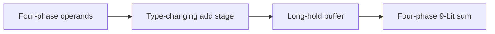

# Getting started

This walkthrough emits a two-stage adder pipeline from a standalone sbt project
that depends only on the library JAR. A separate first test exercises a clocked
bridge using ScalaTest and ChiselSim.

## Install the tools you need

Use JDK 21, sbt 1.12.4, and the Chisel/Scala versions in the
[compatibility matrix](../README.md#compatibility-matrix). Emission needs native
firtool 1.160.0. Chisel can resolve its compiler; to use an installed copy, set
`CHISEL_FIRTOOL_PATH` to the **directory containing** `firtool` or `firtool.exe`.
Python is not needed to compile or elaborate your consumer project.

Simulation is optional for the first emission. The included Scala test needs
Verilator 5.046 and its C++/make toolchain. Delay-sensitive asynchronous tests and
strict export validation use Icarus 13 and the repository's Python tools. Follow
[testing](testing.md) when you reach that step.

## Obtain the library

No public release is available yet. From a checkout of this repository, publish the
development snapshot to your machine's local Ivy cache:

```text
sbt publishLocal
```

If you use the contributor bootstrap, the equivalent is
`python tools/sbt.py publishLocal` in its configured JDK environment. This does not
upload anything to GitHub or Maven Central.

Copy [examples/quickstart](../examples/quickstart) into a new directory, or create
the following `build.sbt` and `project/build.properties` there. This is a separate
sbt build; it has no `.dependsOn` relationship to the source repository.

<!-- source: ../examples/quickstart/build.sbt -->
```scala
ThisBuild / scalaVersion := "2.13.18"
val chiselVersion = "7.16.0"

libraryDependencies ++= Seq(
  "io.github.biscutlabs" %% "chisel-async" % "0.1.0-SNAPSHOT",
  "org.scalatest" %% "scalatest" % "3.2.20" % Test
)
addCompilerPlugin("org.chipsalliance" % "chisel-plugin" % chiselVersion cross CrossVersion.full)
scalacOptions ++= Seq("-deprecation", "-feature", "-unchecked", "-Ymacro-annotations")
Test / parallelExecution := false
publish / skip := true
```

<!-- source: ../examples/quickstart/project/build.properties -->
```properties
sbt.version=1.12.4
```

Chisel arrives as a transitive dependency. Its compiler plugin must still be
declared in the consumer build and must match both Chisel and the full Scala
version. `%%` selects the library's Scala binary suffix (`_2.13`); the plugin uses
`CrossVersion.full` instead.

After publication, replace `0.1.0-SNAPSHOT` with the release named in its
compatibility matrix. Maven Central will require no custom resolver or GitHub
token. Until then, a fresh machine cannot resolve this snapshot without local
publication.

## Emit a typed pipeline

Use the complete [Quickstart.scala](../examples/quickstart/src/main/scala/Quickstart.scala)
as `src/main/scala/Quickstart.scala`, then run from your new project:

```text
sbt "runMain EmitQuickstart"
```

The design consumes a Bundle containing two 8-bit operands and produces a 9-bit
sum. `+&` preserves the carry. A `FourPhaseStage[Operands, UInt]` transforms the
token; a `LongHoldBuffer` stores its result. Each has one reserved token slot.



`asyncChild` shares the parent's reset-domain identity, wires reset, and registers
each child for export. `FourPhase.connect(consumer, producer)` checks widths,
payload shape, and reset identity. The top-level channels and capacity are
registered explicitly in the contract.

The timing values in the example are **illustrative digital-model values**. They
are positive bounds with conservative guards, not a target frequency or a physical
implementation prescription. See [bundled timing](bundled-data.md#timing-policy).

The `generated` directory contains SystemVerilog, packaged primitive sources,
`filelist.f`, `design.hw.mlir`, `ref_AddPipeline.sv`, `ports.json`, and
`contract.json`. Successful emission alone does not validate the contract. With
the repository's verification dependencies and Icarus installed, run:

```text
python /path/to/chisel-async/tools/check_export.py /path/to/your/project/generated
```

Substitute actual paths and quote those containing spaces. The checker writes
`resolved.json`; see [export and validation](timing-and-export.md#export-workflow)
for what it proves. The validator is currently repository tooling, not a separate
published package.

## Run the first test

The project includes [BridgeSpec.scala](../examples/quickstart/src/test/scala/BridgeSpec.scala).
On a configured Linux host:

```text
sbt test
```

This test drives a `DecoupledToFourPhase` bridge through four complete handshakes,
including repeated equal values and downstream stalls. It checks stable payloads,
backpressure, request return and acknowledgement return with bounded waits.
It tests the clocked bridge; it is not a simulation of the delayed adder pipeline.
The [testing guide](testing.md) explains how to test that pipeline with an event
simulator and how to configure native Windows ChiselSim.

Next: [understand channels and reset](concepts.md), then
[choose and compose components](components.md).
